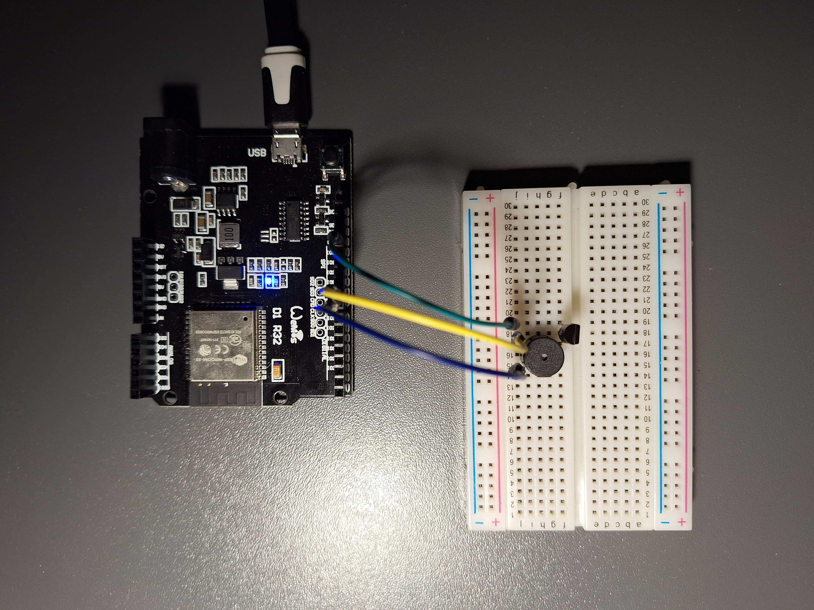

# WiFi metronome

Milan Vodák (xvodak07)

IMP project, 2024

This is a metronome built using ESP32 and a continuous buzzer.
The metronome's tempo, rhythm and volume are controlled via a web interface served over WiFi.

## Hardware

- ESP32 MCU
- continuous buzzer
- MOSFET transistor

## Setup

You need [ESP-IDF](https://docs.espressif.com/projects/esp-idf/en/stable/esp32/get-started/index.html#installation) and [Node.js](https://nodejs.org/en/download/package-manager) installed.

1. `cd frontend && npm install`
2. `npm run build`
3. `cd .. && idf.py set-target esp32`
4. `idf.py menuconfig`, go to "Metronome" and set pin numbers and WiFi credentials.
5. `idf.py build flash`
6. The controls page should now be running at [http://metronome.local/index.html](http://metronome.local/index.html).

## Project structure

- `main/` – the main ESP-IDF component
    - `main.c` – program entrypoint
    - `metronome.c`, `metronome.h` – metronome loop and controls
    - `server.c`, `server.h` – web server and WebSocket handling
    - `wifi.c`, `wifi.h` – WiFi connection
    - `Kconfig.projbuild` – menuconfig options
- `frontend/` – the frontend

## Implementation

One GPIO pin (_volume pin_) is used to generate a PWM signal and another one (_control pin_) to turn on and off the buzzer via the transistor.

After boot, the MCU connects to WiFi using credentials specified in `menuconfig`.
Then, a HTTP server is started that serves static files and handles incoming HTTP request and WebSocket messages.
The server has its own domain `metronome.local`, set via mDNS.
The metronome itself starts shortly afterwards in a separate task.

The metronome is controlled using WebSocket messages.
After handshake, the server sends a JSON object with current metronome settings – tempo (BPM), volume and number of beats.
The client sends messages with prefix `bpm:`, `vol:` and `bts:` to set the tempo, volume and number of beats, respectively.
Starting and stopping the metronome is done by sending HTTP PATCH requests.

Every metronome beat consists of these steps:

- set _control pin_ level to 1
- wait for `beat_length` ms
- set _control pin_ level to 0
- wait for `period - beat_length` ms

Every measure consists of a set number of beats, of which the first one is accented.
Period is calculated from current tempo in BPM (beats per minute) and `beat_length` is always set to 1/4 of the period
with the exception of accented beats, which are twice as long.

Volume is regulated by changing duty cycle of the PWM signal on _volume pin_.

The controls page is written in TypeScript using [Svelte](https://svelte.dev/) framework and [Flowbite](https://flowbite-svelte.com/) component library.
